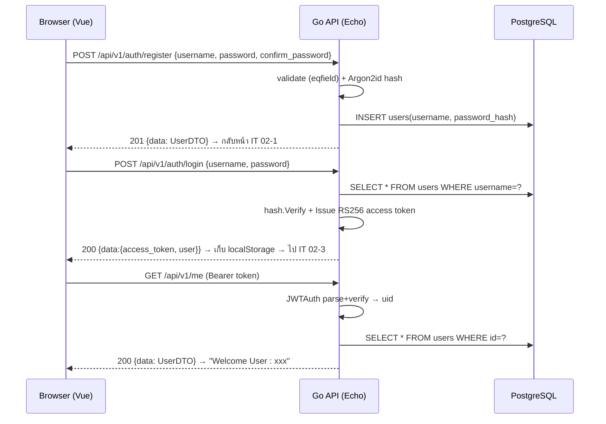

# Design — ระบบสมัครสมาชิก / ลงชื่อเข้าใช้งาน (interview-question-xxx)

> เอกสารออกแบบระบบตามโจทย์ `No2.docx` (IT 02) — Frontend (Vue) + Backend (Go) + PostgreSQL
> **Backend ยึดโครงสร้าง (Clean Architecture) และ conventions เดียวกับ `keyvc-backend`** — Echo v4 + GORM + Argon2id + RS256 JWT + Viper + pure-Go migrations + `pkg/response` envelope โดย "ตัดให้เหลือเฉพาะที่โจทย์ต้องการ"

## 1. ภาพรวม (Overview)

3 หน้าจอสำหรับ **สมัครสมาชิก / ลงชื่อเข้าใช้งาน**:

1. **IT 02-1** — หน้าล็อกอิน: ช่อง `User`, `Password` + ปุ่ม "ลงชื่อเข้าใช้งาน" + ลิงก์ "สมัครสมาชิก"
2. **IT 02-2** — หน้าสมัครสมาชิก: ช่อง `User`, `Password`, `Confirm Password` + ปุ่ม "สมัครสมาชิก"
3. **IT 02-3** — หน้าต้อนรับ: แสดง `Welcome User : xxx`

### เงื่อนไขจากโจทย์ → วิธีรองรับ
| # | ข้อกำหนด | รองรับด้วย |
|---|----------|-----------|
| 1 | กด "สมัครสมาชิก" ที่ IT 02-1 → แสดง IT 02-2 | Vue Router route `/register` |
| 2 | Password ต้องตรงกับ Confirm Password และ input แสดงเป็น `*` | client validate + `validate:"eqfield=Password"` ฝั่ง server, `<input type="password">` |
| 3 | สมัครสำเร็จ → บันทึกลง DB → กลับหน้า IT 02-1 | `POST /api/v1/auth/register` → redirect `/` |
| 4 | Password ที่เก็บใน DB ต้อง **เข้ารหัส** | **Argon2id** (`pkg/hash`) — ไม่เก็บ plaintext |
| 5 | ล็อกอิน → แสดง IT 02-3 + ชื่อผู้ใช้ + **validate JWT** | `POST /api/v1/auth/login` ออก JWT (RS256), `GET /api/v1/me` verify token |
| 6 | โครงสร้าง DB ออกแบบตามเหมาะสม | ตาราง `users` (ดูหัวข้อ 4) |

### ข้อกำหนดการส่งงาน
- Gitlab repository ชื่อ `interview-question-xxx`
- ตั้งชื่อ website/package เสมือนทำงานที่ `example.com` → Go module = `example.com/interview-question-xxx`, frontend package = `@example/interview-question-xxx-frontend`

---

## 2. Tech Stack

| ส่วน | เทคโนโลยี | อ้างอิงจาก keyvc-backend |
|------|-----------|--------------------------|
| Frontend | Vue 3 (`<script setup>`) + Vite + Vue Router + Pinia + **TypeScript** + plain CSS | (โปรเจกต์ใหม่) |
| Backend framework | Go 1.24 + **Echo v4** | `labstack/echo/v4` |
| ORM / DB | **GORM** + `gorm.io/driver/postgres` (Postgres 16) | `internal/infrastructure/db/postgres.go` |
| Password hash | **Argon2id** (m=64MB, t=3, p=2) | `pkg/hash/argon2.go` (คัดลอกทั้งไฟล์) |
| JWT | **RS256** access token, keypair PEM | `pkg/jwt/jwt.go` (คัดลอก, ใช้เฉพาะ access) |
| Config | **Viper** — env > config.yaml > defaults | `config/config.go` (ตัดเหลือ App/DB/JWT) |
| Migrations | **Pure-Go** engine (register ผ่าน `init()`, tx ต่อ step) | `internal/infrastructure/db/migrate/` (คัดลอก engine) |
| Response | envelope `{ success, data, error }` | `pkg/response/response.go` (คัดลอกทั้งไฟล์) |
| Validation | `go-playground/validator/v10` ผ่าน `e.Validator` | `internal/delivery/http/validator.go` |
| Logger | Zap (JSON) | `internal/infrastructure/logger/zap.go` |
| Auth transport | JWT เก็บใน `localStorage`, ส่ง `Authorization: Bearer <token>` | (ตัด refresh-cookie ออก) |

สี header เขียวจาก mockup = `#00B050`

### สิ่งที่ **ตัดออก** จาก keyvc (ไม่จำเป็นกับโจทย์ — ระบุไว้กันเข้าใจผิด)
Redis / sessions / refresh-token rotation / OTP-2FA / mailer / rate-limit / anomaly / audit log / account-lockout / telemetry (OTel+Prometheus) / object storage (S3) / websocket. โครง Clean Architecture ยังเหมือนเดิม เพียงมี usecase/handler/repo เท่าที่ auth ต้องใช้

---

## 3. Architecture (Clean Architecture — dependency ชี้เข้าใน)

```
delivery ──┐
           ├──→ usecase ──→ domain  ←── repository
infra   ───┘
```

Monorepo `interview-question-xxx/` แยก `backend/` (โครงตาม keyvc) + `frontend/` (Vue)

```
interview-question-xxx/
├── README.md
├── DESIGN.md
├── backend/
│   ├── go.mod                       # module: example.com/interview-question-xxx
│   ├── Makefile                     # dev / run / build / tidy / migrate-up / keys
│   ├── .env.example
│   ├── config/
│   │   ├── config.go                # Viper loader — sections: App, DB, JWT (ตัดจาก keyvc)
│   │   └── config.yaml.example
│   ├── secrets/                      # RS256 keypair (gitignored) — สร้างด้วย `make keys`
│   │   ├── jwt_private.pem
│   │   └── jwt_public.pem
│   ├── cmd/
│   │   ├── api/main.go              # Echo + DI wiring + graceful shutdown
│   │   └── migrate/main.go          # CLI: up | down [n] | status
│   ├── internal/
│   │   ├── domain/
│   │   │   ├── user.go              # entity User + UserRepository interface
│   │   │   └── errors.go            # sentinel: ErrNotFound, ErrConflict, ErrInvalidCredentials
│   │   ├── usecase/
│   │   │   └── auth_usecase.go      # Register / VerifyPassword / IssueToken
│   │   ├── repository/postgres/
│   │   │   └── user_repo.go         # GORM impl ของ UserRepository
│   │   ├── delivery/http/
│   │   │   ├── router.go            # Deps + RegisterRoutes
│   │   │   ├── validator.go         # go-playground validator adapter
│   │   │   ├── dto/auth.go          # RegisterRequest / LoginRequest / LoginResponse / UserDTO
│   │   │   ├── handler/
│   │   │   │   ├── auth_handler.go  # Register, Login
│   │   │   │   ├── user_handler.go  # Me
│   │   │   │   └── health_handler.go
│   │   │   └── middleware/
│   │   │       ├── jwt.go           # JWTAuth → ใส่ uid/username เข้า context
│   │   │       └── cors.go
│   │   └── infrastructure/
│   │       ├── db/
│   │       │   ├── postgres.go      # GORM connect + pool (คัดลอกจาก keyvc)
│   │       │   └── migrate/
│   │       │       ├── migrate.go   # engine (คัดลอก) — schema_migrations, Up/Down/Status
│   │       │       └── migrations/001_create_users.go
│   │       └── logger/zap.go        # (คัดลอกจาก keyvc)
│   └── pkg/
│       ├── hash/argon2.go           # (คัดลอกทั้งไฟล์)
│       ├── jwt/jwt.go               # (คัดลอก — ใช้เฉพาะ AccessToken)
│       └── response/response.go     # (คัดลอกทั้งไฟล์)
└── frontend/
    ├── package.json                 # name: @example/interview-question-xxx-frontend
    ├── vite.config.ts               # dev proxy /api → backend :8080
    ├── .env.example                 # VITE_API_BASE_URL
    ├── index.html
    └── src/
        ├── main.ts
        ├── App.vue                  # <router-view/>
        ├── router/index.ts          # 3 routes + navigation guard
        ├── stores/auth.ts           # Pinia: token, username, actions
        ├── api/client.ts            # fetch wrapper: unwrap envelope + แนบ Bearer
        ├── components/FormFrame.vue  # กรอบ + header เขียว (#00B050) prop title
        └── views/
            ├── LoginView.vue        # IT 02-1
            ├── RegisterView.vue     # IT 02-2
            └── WelcomeView.vue      # IT 02-3
```

**กติกาการเพิ่ม feature (ตาม keyvc):** domain interface → usecase → repository → delivery handler → router. ห้าม delivery เรียก GORM ตรง, ห้าม import Echo/GORM ใน `usecase`/`domain`

---

## 4. Database Design

ตาราง `users` เดียว — สร้างผ่าน pure-Go migration `001_create_users.go` (register version 1 ใน `init()`)

```sql
CREATE EXTENSION IF NOT EXISTS "uuid-ossp";

CREATE TABLE IF NOT EXISTS users (
    id            UUID PRIMARY KEY DEFAULT uuid_generate_v4(),
    username      VARCHAR(100) NOT NULL,
    password_hash TEXT         NOT NULL,         -- Argon2id encoded string ($argon2id$v=19$...)
    created_at    TIMESTAMPTZ  NOT NULL DEFAULT NOW(),
    updated_at    TIMESTAMPTZ  NOT NULL DEFAULT NOW(),
    CONSTRAINT uq_users_username UNIQUE (username)
);
CREATE INDEX IF NOT EXISTS idx_users_username ON users (username);
```

- ตรงกับ pattern `001_init.go` ของ keyvc (uuid PK + `uuid-ossp`, unique index)
- โจทย์ใช้ **User** (username) ไม่ใช่ email → domain entity เก็บ `Username`
- `password_hash` = Argon2id encoded string เท่านั้น (ข้อกำหนดข้อ 4 "เข้ารหัส")
- domain entity `User` แบบย่อ: `ID`, `Username`, `PasswordHash`, `CreatedAt`, `UpdatedAt` (ตัด field KYC/role/2FA/lockout ทั้งหมดของ keyvc ออก)

---

## 5. Backend Design

### 5.1 API Contract (envelope `{success, data, error}` — prefix `/api/v1`)

| Method | Path | Auth | Request | Data ที่สำเร็จ |
|--------|------|------|---------|----------------|
| POST | `/api/v1/auth/register` | — | `{ username, password, confirm_password }` | `201` → `UserDTO` |
| POST | `/api/v1/auth/login` | — | `{ username, password }` | `200` → `{ access_token, expires_in, user }` |
| GET  | `/api/v1/me` | Bearer | — | `200` → `UserDTO` |
| GET  | `/healthz` `/readyz` | — | — | liveness / readiness |

`UserDTO = { id, username, created_at }`

### 5.2 Validation & Error (ใช้ helper จาก `pkg/response`)
- register: `username` `required,min=3,max=100`; `password` `required,min=8,max=128`; `confirm_password` `required,eqfield=Password` → ไม่ผ่าน `response.BadRequest` (`400`)
- register: username ซ้ำ → usecase คืน `domain.ErrConflict` → `response.Fail(c, 409, "USERNAME_TAKEN", ...)` (repo ดัก unique violation `23505` เหมือน `user_repo.go`)
- login: ไม่พบ user หรือ Argon2 ไม่ตรง → `domain.ErrInvalidCredentials` → `response.Unauthorized` (`401`, ข้อความรวม กัน enumeration)
- `/me`: token หาย/ผิด/หมดอายุ → middleware `JWTAuth` ตอบ `response.Unauthorized` (`401`)

### 5.3 Flow ภายใน (mirror keyvc `auth_usecase.go` แบบย่อ)
- **Register**: handler `c.Bind` + `c.Validate` → `authUC.Register(ctx, username, password)`：`GetByUsername` เช็คซ้ำ → `hash.Hash(password)` (Argon2id) → `users.Create` → `response.Created(UserDTO)`
- **Login**: `authUC.VerifyPassword(username, password)`：`GetByUsername` → `hash.Verify` → ออก access token `tokens.Issue(uid, username, "", jwt.AccessToken)` → `response.OK({access_token, expires_in, user})`
- **Me**: `JWTAuth` parse token → set `uid`/`username` ใน context → `userUC`/handler อ่าน `uid` → `GetByID` → `response.OK(UserDTO)`

### 5.4 JWT (RS256 — เหมือน keyvc)
- reuse `pkg/jwt.Manager` (โหลด `jwt_private.pem` / `jwt_public.pem`, sign RS256, `Parse` ตรวจ method + issuer + exp)
- claims: `uid`, `username`, `typ=access`, `iss`, `sub`, `exp`, `iat`
- ออกเฉพาะ **access token** (ตัด refresh/session ออก); TTL เช่น 60 นาที (config)
- keypair สร้างด้วย `make keys` (openssl) — ใส่ `secrets/` ที่ gitignore

### 5.5 Config (Viper — `.env` / env var) 
```
APP_ENV=development
APP_PORT=8080
APP_ALLOWED_ORIGINS=http://localhost:5173
DB_HOST=localhost
DB_PORT=5432
DB_USER=...
DB_PASSWORD=...
DB_NAME=...
DB_SSLMODE=disable
JWT_PRIVATE_KEY_PATH=./secrets/jwt_private.pem
JWT_PUBLIC_KEY_PATH=./secrets/jwt_public.pem
JWT_ACCESS_TTL=60m
JWT_ISSUER=example.com
```

### 5.6 Middleware chain (ย่อจาก keyvc)
`RequestID → Recover → ZapLogger → CORS → routes` ; ต่อ route ที่ป้องกัน (`/me`) เพิ่ม `JWTAuth`

---

## 6. Frontend Design

### 6.1 Routes (`src/router/index.ts`)
| Path | View | ตรงกับ | Guard |
|------|------|--------|-------|
| `/` | LoginView | IT 02-1 | มี token → redirect `/welcome` |
| `/register` | RegisterView | IT 02-2 | — |
| `/welcome` | WelcomeView | IT 02-3 | ไม่มี token → redirect `/` |

### 6.2 Pinia store (`stores/auth.ts`)
- state: `token` (init จาก localStorage), `username`
- actions: `register()`, `login()` (เก็บ token), `fetchMe()` (GET /me), `logout()`
- getter: `isAuthenticated`

### 6.3 API client (`api/client.ts`)
wrapper รอบ `fetch`: base URL จาก `VITE_API_BASE_URL`, แนบ `Authorization: Bearer <token>`, **unwrap envelope** (`success=false` → throw `error.message`), จับ `401` → เคลียร์ token + กลับหน้าล็อกอิน

### 6.4 `components/FormFrame.vue`
กรอบขอบดำ + แถบ header เขียว `#00B050` (ตัวอักษรขาว) รับ prop `title` — ใช้ซ้ำ 3 หน้าให้ตรง mockup

### 6.5 หน้าจอ ↔ ข้อกำหนด
- **IT 02-1 / LoginView**: `User`, `Password` (`type="password"` → `*`), ปุ่ม "ลงชื่อเข้าใช้งาน" → `login()` สำเร็จไป `/welcome`, ลิงก์ "สมัครสมาชิก" → `/register`
- **IT 02-2 / RegisterView**: `User`, `Password`, `Confirm Password` (สองช่องหลัง masked), ปุ่ม "สมัครสมาชิก" — client เช็ค `password === confirmPassword` ก่อนยิง API, สำเร็จ → กลับ `/`
- **IT 02-3 / WelcomeView**: on mount `fetchMe()` (backend validate JWT) แสดง `Welcome User : {username}`; token ใช้ไม่ได้ → เด้งกลับ `/`

---

## 7. Auth Flow



---

## 8. Security Notes
- Password เก็บเป็น **Argon2id** เท่านั้น ไม่มี plaintext ที่ใด (คง params m=64MB,t=3,p=2 จาก keyvc)
- error ตอน login รวมกัน ("username หรือ password ไม่ถูกต้อง") กัน user enumeration
- JWT **RS256** (asymmetric) — private key ใน `secrets/` (gitignored), token มี `exp`
- CORS allowlist เฉพาะ origin ของ frontend
- **Trade-off**: เก็บ access token ใน localStorage สะดวกและเห็น JWT ชัดตามโจทย์ แต่เสี่ยง XSS มากกว่า httpOnly cookie (keyvc ใช้ refresh-cookie; โจทย์นี้ตัด refresh ออกจึงเก็บ access ใน localStorage) — เหมาะกับบริบทสัมภาษณ์

---

## 9. Implementation Steps
1. โครง monorepo + `README.md` (วิธีรัน) + คัดลอก `DESIGN.md`
2. **Backend – ก็อป pkg/infra ที่ reuse ตรงจาก keyvc**: `pkg/hash`, `pkg/jwt`, `pkg/response`, `infrastructure/db/postgres.go`, `infrastructure/db/migrate/migrate.go`, `infrastructure/logger/zap.go`, `delivery/http/validator.go`, `middleware/cors.go`, `middleware/jwt.go` (ปรับ claims), `config/config.go` (ตัดเหลือ App/DB/JWT)
3. **Backend – เขียนใหม่เฉพาะ auth slice**: `domain/user.go`+`errors.go` → `repository/postgres/user_repo.go` → `usecase/auth_usecase.go` → `dto/auth.go` → `handler/{auth,user,health}` → `router.go` → `cmd/api/main.go` (DI) + `cmd/migrate/main.go`
4. **Migration**: `001_create_users.go` → `make migrate-up` กับ PostgreSQL ที่เตรียมไว้; `make keys` สร้าง RS256 keypair
5. **Frontend**: `npm create vite` (vue-ts) → router+pinia → `FormFrame` → 3 views → store → api client (unwrap envelope) → CSS ตรง mockup
6. `.env.example` ทั้งสองฝั่ง + คำสั่งรันใน README

---

## 10. Verification (ทดสอบ end-to-end)
- **API (curl)**: register → login (ได้ `access_token` ใน `data`) → `/api/v1/me` ด้วย Bearer (ได้ `username`); error paths: register ซ้ำ (409 `USERNAME_TAKEN`), `confirm_password` ไม่ตรง (400), login ผิด (401), token ปลอม/หมดอายุ (401)
- **DB**: `SELECT username, password_hash FROM users;` — ยืนยัน `password_hash` ขึ้นต้น `$argon2id$` (ไม่ใช่ plaintext)
- **Migration**: `make migrate-status` เห็น version 1 applied
- **UI ครบวงจร**: IT 02-1 → "สมัครสมาชิก" → IT 02-2 กรอกแล้วสมัคร → กลับ IT 02-1 → ล็อกอิน → IT 02-3 เห็น "Welcome User : &lt;username&gt;"; ยืนยัน input password แสดงเป็น `*`
- **Guard**: refresh หน้า IT 02-3 ยังอยู่ (token persist), เปิด `/welcome` โดยไม่มี token → เด้งกลับ `/`
- **Unit test** (แบบ keyvc `auth_usecase_test.go`): mock `UserRepository`, ทดสอบ Register (ซ้ำ→ErrConflict) + VerifyPassword (ผิด→ErrInvalidCredentials)
